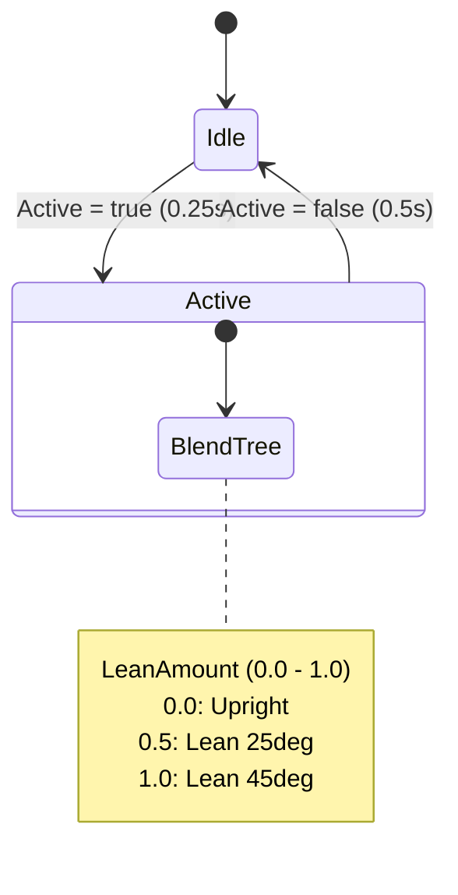

# アニメーション仕様

## 概要

SexyDistanceGimmick の Animator で使用するアニメーションクリップの仕様。

---

## Animator パラメータ

| 名前 | 型 | 説明 |
|------|-----|------|
| `Active` | Bool | ギミック起動状態 |
| `LeanAmount` | Float | 前傾量（0.0 〜 1.0） |

---

## 必要アニメーション

### 1. Idle（待機）

```
ファイル名: Idle.anim
用途: Active = false 時、またはプレイヤーが遠い時
姿勢: 直立、自然な待機ポーズ
ループ: はい
備考: 呼吸や微細な揺れを入れると自然
```

### 2. Lean Blend（前傾ブレンド）

LeanAmount の値に応じて補間される3段階のポーズ。

#### Lean_0.anim（LeanAmount = 0.0）

```
姿勢: ほぼ直立
頭部: 正面向き
上半身: わずかに前傾（5度程度）
腕: 自然に下ろした状態
```

#### Lean_50.anim（LeanAmount = 0.5）

```
姿勢: 中程度の前傾
頭部: やや下向き、相手を見上げるような角度
上半身: 前傾（25度程度）
腕: 片手を前に伸ばしかけている
```

#### Lean_100.anim（LeanAmount = 1.0）

```
姿勢: 最大前傾
頭部: 相手の耳元に近い位置
上半身: 強い前傾（45度程度）
腕: 相手に触れようとしている、または回そうとしている
顔: 相手の顔のすぐ横
```

---

## Blend Tree 設定

```
Type: 1D
Parameter: LeanAmount
Thresholds:
  - 0.0 → Lean_0.anim
  - 0.5 → Lean_50.anim
  - 1.0 → Lean_100.anim
```

---

## State Machine 構造



### トランジション設定

| From | To | Condition | Duration |
|------|----|-----------|----------|
| Idle | Active | Active = true | 0.25秒 |
| Active | Idle | Active = false | 0.5秒 |

---

## 接触点別 LeanAmount 値

コード内で設定済み。アニメーション側での対応不要。

| 状態 | LeanAmount |
|------|------------|
| 非接触（デフォルト） | 0.33 |
| 胸接触 | 0.50 |
| 首接触 | 0.65 |
| 耳接触 | 0.70 |
| 腰接触 | 0.45 |
| 太腿接触 | 0.40 |

---

## Humanoid リターゲット

Humanoid アバターを使用する場合：

1. アニメーションを **Generic** ではなく **Humanoid** として作成
2. Avatar Mask は不要（全身を使用）
3. Root Motion は **OFF**

---

## 配置先

```
Assets/SexyDistanceGimmick/Animations/
├─ Ghost.controller
├─ Idle.anim
├─ Lean_0.anim
├─ Lean_50.anim
└─ Lean_100.anim
```

---

## 作成ツール

以下のいずれかで作成可能：

- **Unity 内蔵**: Animation Window でポーズを手動作成
- **Blender**: ポーズ作成 → FBX エクスポート → Unity でクリップ分割
- **VRoid / その他**: ポーズプリセットをエクスポート
