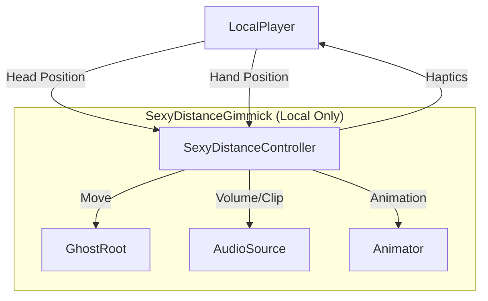
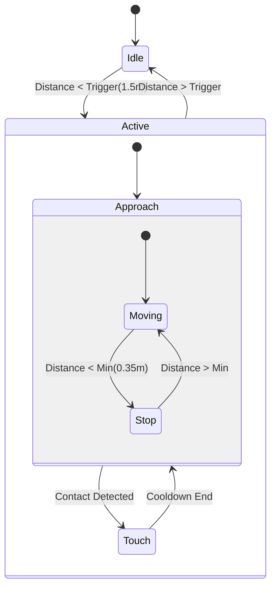

# SexyDistanceGimmick

## マスター仕様書（完全統合版 v2.0）

**改訂日**: 2026-01-02  
**改訂理由**: 技術的レビューに基づく必須パラメータの明示化および実装ロジックの最適化

---

## 0. 本書の位置づけ

本書は、VRChat Worlds 上で動作する
**「Sexy Distance Gimmick」**に関する、

* 要件定義
* 体験仕様
* 設計仕様
* ロジック仕様
* 実装指示
* 作業手順
* 配布仕様
* Booth 商品仕様

を**すべて統合した最上位文書**である。

本書より下位の文書は存在しない。
本書と矛盾する実装・設計・説明は**すべて不正**とする。

---

## 1. システム概要

### 1.1 システム名称

* SexyDistanceGimmick

### 1.2 対象環境

* VRChat Worlds
* Unity 2019.4.31f1 以降
* VRChat SDK Worlds 3.x
* UdonSharp 1.x

### 1.3 実行主体

* LocalPlayer のみ

### 1.4 通信

* Networking API 不使用（完全ローカル動作）

---

### 1.5 システム構造図



### 1.6 状態遷移図



---

## 2. 目的（Goal）

### 唯一の目的

* **距離そのものが、プレイヤーに侵入してくる性感体験を成立させること**

この目的以外は一切考慮しない。

---

## 3. 体験定義（Experience）

### 3.1 必須体験

以下がすべて成立していること。

1. プレイヤー操作なしで体験が始まる
2. ゴーストが能動的に距離を詰める
3. プレイヤーは距離主導権を持たない
4. 近づくほど囁きが強化される
5. 手が触れることで反応が変化する
6. 体験は終了しない

### 3.2 禁止体験

* 選択肢
* 成功／失敗
* クライマックス
* 終了演出
* 離脱処理
* リセット（ただし開発時デバッグ用リセットは例外とする）

---

## 4. システム構造

### 4.1 ローカル原則

* 発火・更新・音・触覚は LocalPlayer のみ
* 他プレイヤーの存在を一切参照しない
* ワールド状態を変更しない

### 4.2 VR対応

* VRモード: 完全動作
* デスクトップモード: 視覚・音響のみ（ハプティクス無効）

---

## 5. Hierarchy（固定）

```
SexyDistanceGimmick
├─ GhostRoot
│  ├─ GhostVisual
│  ├─ GhostTouch_Chest
│  ├─ GhostTouch_Neck
│  ├─ GhostTouch_Ear_L
│  ├─ GhostTouch_Ear_R
│  ├─ GhostTouch_Waist
│  └─ GhostTouch_Thigh
├─ Audio_Whisper
└─ Audio_Touch
```

* 構造変更禁止
* 追加オブジェクト禁止

---

## 6. 主要パラメータ（確定版）

### 6.1 距離制御

```csharp
triggerDistance = 1.5f      // トリガー距離（m）
minDistance = 0.35f          // 最小侵入距離（m）
moveSpeed = 0.18f            // 移動速度（m/s）
```

### 6.2 接触判定

```csharp
touchRadius = 0.09f          // 接触判定半径（m）
touchCooldown = 0.35f        // 接触クールダウン（秒）
touchPriority = "latest"     // 接触優先順位（最新を優先）
```

### 6.3 音響制御

```csharp
whisperBaseMaxVolume = 0.22f     // 囁き基本最大音量
whisperHoldDuration = 2.0f       // 接触後の音量保持時間（秒）
touchSoundVolume = 0.35f         // 接触音音量
```

### 6.4 前傾制御（LeanAmount）

```csharp
leanAmount_Default = 0.33f       // 非接触時
leanAmount_Chest = 0.50f         // 胸接触時
leanAmount_Neck = 0.65f          // 首接触時
leanAmount_Ear = 0.70f           // 耳接触時（左右共通）
leanAmount_Waist = 0.45f         // 腰接触時
leanAmount_Thigh = 0.40f         // 太腿接触時
```

### 6.5 推奨プリセット：Yobai Mode (男のロマン版)

「寝込みを襲われる」シチュエーションに特化した調整値。

```csharp
triggerDistance = 2.0f       // 気配は早めに察知させる
minDistance = 0.15f          // 限界まで近づく（吐息がかかる距離）
moveSpeed = 0.08f            // じわじわと、焦らすように遅く
touchCooldown = 1.5f         // 接触の余韻を長く残す
whisperHoldDuration = 4.0f   // 囁きを長く聞かせる
```

---

## 7. 距離侵入ロジック（最適化版）

### 7.1 不変条件

* 常に頭部方向へ移動
* 直線移動のみ
* minDistance 未満に侵入しない
* 後退・反転・停止なし

### 7.2 実装ロジック（最適化済み）

```csharp
void UpdateGhostPosition()
{
    Vector3 headPos = Networking.LocalPlayer.GetTrackingData(VRCPlayerApi.TrackingDataType.Head).position;
    Vector3 toHead = headPos - ghostRoot.position;
    float dist = toHead.magnitude;
    
    if (dist > minDistance)
    {
        // オーバーシュート防止: 移動量を制限
        float moveAmount = Mathf.Min(moveSpeed * Time.deltaTime, dist - minDistance);
        ghostRoot.position += toHead.normalized * moveAmount;
    }
}
```

**最適化ポイント**:
- 距離計算を1回のみ実施
- オーバーシュート防止が明示的
- 二重補正が不要

---

## 8. 囁き制御

### 8.1 基本音量制御

距離に基づく線形補間:

```csharp
float CalculateWhisperVolume(float distance)
{
    if (distance >= triggerDistance) return 0f;
    
    // 距離が近いほど音量大
    float t = 1f - Mathf.Clamp01((distance - minDistance) / (triggerDistance - minDistance));
    return Mathf.Lerp(0f, whisperBaseMaxVolume, t);
}
```

### 8.2 接触時制御

```csharp
// 接触検出時
if (touchDetected)
{
    whisperHoldTimer = whisperHoldDuration;  // 2.0秒
    currentWhisperClip = touchSpecificClip;   // 接触点別クリップに切替
    whisperSource.clip = currentWhisperClip;
    whisperSource.Play();
}

// 毎フレーム更新
if (whisperHoldTimer > 0f)
{
    whisperHoldTimer -= Time.deltaTime;
    whisperSource.volume = whisperBaseMaxVolume;  // 保持中は最大音量
}
else
{
    whisperSource.volume = CalculateWhisperVolume(currentDistance);
}
```

### 8.3 囁きクリップ仕様

```
Whisper_Default.wav      // 非接触・接近時
Whisper_Chest.wav        // 胸接触時
Whisper_Neck.wav         // 首接触時
Whisper_Ear.wav          // 耳接触時
Whisper_Waist.wav        // 腰接触時
Whisper_Thigh.wav        // 太腿接触時
```

---

## 9. 接触仕様

### 9.1 判定ロジック

```csharp
void CheckTouch()
{
    if (touchCooldownTimer > 0f)
    {
        touchCooldownTimer -= Time.deltaTime;
        return;  // クールダウン中は判定スキップ
    }
    
    VRCPlayerApi player = Networking.LocalPlayer;
    Vector3 leftHand = player.GetTrackingData(VRCPlayerApi.TrackingDataType.LeftHand).position;
    Vector3 rightHand = player.GetTrackingData(VRCPlayerApi.TrackingDataType.RightHand).position;
    
    // 接触点配列（優先順位順）
    Transform[] touchPoints = new Transform[] 
    {
        touchChest, touchNeck, touchEarL, touchEarR, touchWaist, touchThigh
    };
    
    foreach (Transform point in touchPoints)
    {
        float sqrRadius = touchRadius * touchRadius;
        
        // 平方距離比較で高速化
        if ((leftHand - point.position).sqrMagnitude < sqrRadius ||
            (rightHand - point.position).sqrMagnitude < sqrRadius)
        {
            OnTouchDetected(point);
            return;  // 最初に検出した点のみ処理
        }
    }
}
```

### 9.2 接触時反応

```csharp
void OnTouchDetected(Transform touchPoint)
{
    touchCooldownTimer = touchCooldown;  // 0.35秒
    
    // 1. 接触音再生
    touchAudioSource.PlayOneShot(touchSoundClip, touchSoundVolume);
    
    // 2. 囁きクリップ切替
    whisperHoldTimer = whisperHoldDuration;
    currentWhisperClip = GetWhisperClipForPoint(touchPoint);
    whisperSource.clip = currentWhisperClip;
    whisperSource.Play();
    
    // 3. ハプティクス（VRのみ）
    if (player.IsUserInVR())
    {
        try
        {
            player.PlayHapticEventInHand(VRC_Pickup.PickupHand.Left, 0.3f, 0.5f, 0.2f);
            player.PlayHapticEventInHand(VRC_Pickup.PickupHand.Right, 0.3f, 0.5f, 0.2f);
        }
        catch (System.Exception e)
        {
            Debug.LogWarning($"Haptic failed: {e.Message}");
        }
    }
    
    // 4. 前傾量変更
    targetLeanAmount = GetLeanAmountForPoint(touchPoint);
}
```

### 9.3 接触優先順位

**ルール**: `touchPriority = "latest"`

- 新規接触が発生 → 即座にクールダウンリセット + 前回接触を上書き
- クールダウン中 → 判定自体をスキップ（新規接触を受け付けない）

---

## 10. Animator 制御

### 10.1 パラメータ定義

```
Bool: Active           // ギミック起動状態
Float: LeanAmount      // 前傾量（0.0 ~ 1.0）
```

### 10.2 更新ロジック（最適化版）

```csharp
void UpdateAnimator()
{
    // Active状態
    bool shouldBeActive = (currentDistance < triggerDistance);
    if (animator.GetBool("Active") != shouldBeActive)
    {
        animator.SetBool("Active", shouldBeActive);
    }
    
    // LeanAmount（差分がある場合のみ更新）
    if (Mathf.Abs(animator.GetFloat("LeanAmount") - targetLeanAmount) > 0.01f)
    {
        animator.SetFloat("LeanAmount", targetLeanAmount);
    }
}
```

**最適化ポイント**:
- 値が変化した場合のみ `SetBool()`/`SetFloat()` を呼び出し
- 不要なAnimator更新を削減

---

## 11. 実行フロー（毎フレーム）

```csharp
void Update()
{
    // 1. 頭部位置取得
    Vector3 headPos = GetHeadPosition();
    
    // 2. 距離計算
    float dist = Vector3.Distance(ghostRoot.position, headPos);
    currentDistance = dist;
    
    // 3. Trigger判定
    if (dist < triggerDistance && !isActive)
    {
        isActive = true;
    }
    
    if (!isActive) return;  // 未起動時は以降スキップ
    
    // 4. ゴースト位置更新
    UpdateGhostPosition();
    
    // 5. 囁き音量計算
    UpdateWhisperVolume();
    
    // 6. 接触判定
    CheckTouch();
    
    // 7. 非接触時の前傾リセット
    if (touchCooldownTimer <= 0f)
    {
        targetLeanAmount = leanAmount_Default;
    }
    
    // 8. Animator更新
    UpdateAnimator();
}
```

---

## 12. 実装禁止事項

* `Lerp` / `SmoothDamp` による距離移動（線形移動のみ）
* `Random` 要素の使用
* 選択 UI / ボタン入力
* 終了処理（ギミックは永続動作）
* Networking API の使用
* プレイヤー主導操作

---

## 13. 汎用性・再利用要件

### 13.1 Booth 販売要件

* **Prefab 1点配置のみ**で動作
* Scene 依存なし
* 他ギミック非干渉
* README は**導入手順のみ**（3〜5行）

### 13.2 既存アバター流用

#### Humanoid アバター

* GhostVisual を Humanoid アバターに差し替え
* 接触点は Tポーズ基準で自動配置
* Animator Controller を差し替え
* Root Motion は OFF

#### 非Humanoid アバター

* GhostVisual を任意モデルに差し替え
* **接触点は手動配置が必要**
* 配置ガイド用 Gizmo スクリプトを提供
* Animator Controller は新規作成

### 13.3 アバター要件

* 表情制御: 不要
* IK: 不要
* PhysBone: 不要
* Animator: **必須**（Active/LeanAmount のみ）

---

## 14. ディレクトリ構成

```
Assets/
└─ SexyDistanceGimmick/
   ├─ Prefabs/
   │  └─ SexyDistanceGimmick.prefab
   ├─ UdonSharp/
   │  ├─ SexyDistanceController.cs
   │  └─ GhostTouchGizmo.cs (配置支援用)
   ├─ Animations/
   │  ├─ Ghost.controller
   │  ├─ Idle.anim
   │  ├─ Lean_0.anim
   │  ├─ Lean_50.anim
   │  └─ Lean_100.anim
   ├─ Audio/
   │  ├─ Whisper_Default.wav
   │  ├─ Whisper_Chest.wav
   │  ├─ Whisper_Neck.wav
   │  ├─ Whisper_Ear.wav
   │  ├─ Whisper_Waist.wav
   │  ├─ Whisper_Thigh.wav
   │  └─ Touch.wav
   ├─ Scenes/
   │  └─ SampleScene.unity (動作確認用)
   └─ README.txt
```

---

## 15. 完了条件（Definition of Done）

以下がすべて満たされていること:

* [ ] Trigger 距離侵入で即座に開始
* [ ] ゴーストが `minDistance` まで侵入
* [ ] 囁きが距離で線形変化
* [ ] 接触点ごとに異なる囁き再生
* [ ] 接触点ごとに異なる前傾量
* [ ] ハプティクス動作（VRモード）
* [ ] 自動終了しない
* [ ] Prefab 配置のみで動作
* [ ] サンプルシーンで動作確認可能

---

## 16. Booth 商品説明（要約）

```
【SexyDistanceGimmick】

距離が侵入してくるVR演出ギミック

■ 特徴
・操作不要で自動起動
・距離に応じた囁き演出
・接触時の触覚フィードバック
・Prefab配置のみで即動作
・完全ローカル動作

■ 導入
1. Prefab を Scene に配置
2. VRChat SDK でビルド
3. 完了

■ 動作環境
・VRChat Worlds
・VR / デスクトップ両対応
```

---

## 17. 成果物一覧

### 必須ファイル

1. `SexyDistanceGimmick.prefab` - メインPrefab
2. `SexyDistanceController.cs` - UdonSharp制御スクリプト
3. `Ghost.controller` - Animator Controller
4. 音声ファイル × 7点
5. `README.txt` - 導入手順
6. `SampleScene.unity` - 動作確認用シーン

### 補助ファイル

7. `GhostTouchGizmo.cs` - 接触点配置支援スクリプト
8. `MASTER_SPEC_v2.md` - 本仕様書

---

## 18. デバッグ仕様（開発用のみ）

### リセット機能

```csharp
public void _ResetGimmick()  // Udon Custom Event
{
    #if UNITY_EDITOR
    isActive = false;
    ghostRoot.position = initialPosition;
    animator.SetBool("Active", false);
    animator.SetFloat("LeanAmount", leanAmount_Default);
    whisperSource.Stop();
    Debug.Log("Gimmick Reset (Editor Only)");
    #endif
}
```

**重要**: ビルド後は無効化される（`UNITY_EDITOR`フラグ使用）

---

## 19. 既知の制約・注意事項

### VRデバイス依存

* Quest 2/Pro: ハプティクス正常動作
* PCVR (Index, Vive): ハプティクス正常動作
* デスクトップ: ハプティクス無効（エラーなし）

### トラッキング喪失時

* ヘッドセットを外した場合、頭部位置が更新されない
* ゴーストは最後の位置で停止（仕様）
* 再装着で即座に復帰

### 初回スポーン位置

プレイヤーがすでに `triggerDistance` 内にスポーン:
- 初回起動時は強制的に `isActive = false`
- 一度 `triggerDistance` 外に出てから再侵入で起動

---

## 20. 最終宣言

* **本書に記載されていない機能は存在してはならない**
* **本書に反する挙動はすべて不正実装とする**
* **本書のパラメータ値はすべて確定値であり、実装時に変更してはならない**

---

**この一文書が、企画・実装・販売・再利用のすべてを拘束する最終定義である。**

**改訂履歴**:
- v1.0 (初版): 基本仕様策定
- v2.0 (本版): 技術レビューに基づく必須パラメータ明示化、ロジック最適化、実装ガイドライン追加
