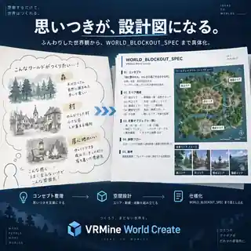
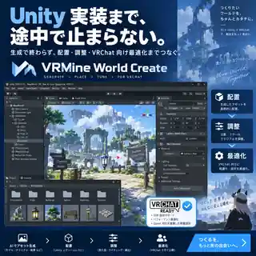

https://kafka2306.github.io/vrmine/
https://kafka2306.github.io/vrmine/io/

# VRMine

VRChat向けワールド素材、ワールド設計、関連インタラクティブコンテンツを、仕様・生成・検証・配布まで一つのrepositoryで扱います。

- Public site: https://kafka2306.github.io/vrmine/
- 3D item catalog: https://kafka2306.github.io/vrmine/io/

## VRMine World Create

企画・設計・素材生成・Unity実装・検証までを、ひとつの再現可能なVRChatワールド制作パイプラインとして扱います。

<p align="center">
  
</p>

| 設計を具体化 | Unity実装までつなぐ | 完成条件で検証 |
| --- | --- | --- |
|  |  |  |

アイデアを「それっぽい画像」で終わらせず、`WORLD_BLOCKOUT_SPEC`、必要アセット、Unity上の配置・調整、VRChat向けの完成条件へ順に落とし込みます。

## Start here

- 開発・agentルールとcanonical path: [`AGENTS.md`](AGENTS.md)
- 実行可能なcommand: [`Taskfile.yml`](Taskfile.yml)
- merge / release gate: [`config/quality-gates.json`](config/quality-gates.json)
- 3D item仕様: [`config/world-items/`](config/world-items/)
- World Design仕様・生成spec: [`config/world-design/`](config/world-design/)

## Verification

repository全体の高速な再現可能チェックは次で実行します。

```bash
task check
```

変更面ごとの最小commandと検証条件は `Taskfile.yml` と `config/quality-gates.json` を正本とし、このREADMEには重複して列挙しません。
